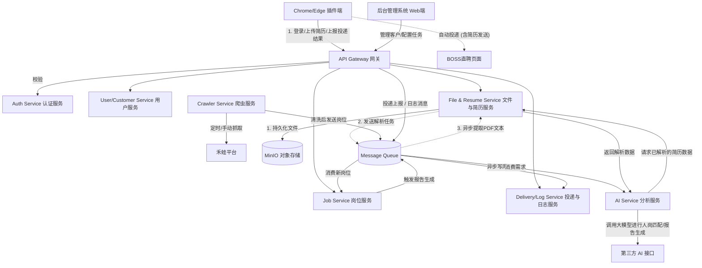

# BOSS直聘智能岗位投递系统 - 微服务架构设计

基于《BOSS直聘智能岗位投递系统开发文档》以及**简历解析与存储需求**，为确保系统的高可用、高扩展性以及各个模块（后端、插件、爬虫、AI、文件存储）的解耦，推荐采用**微服务架构**。以下是针对该系统的微服务架构设计方案。

## 1. 服务拆分 (Microservices Breakdown)

为了实现高内聚、低耦合，建议将系统拆分为以下几个核心微服务：

- **网关服务 (API Gateway)**
  - **职责**: 统一入口，负责请求路由、鉴权拦截、限流熔断、跨域处理。所有来自插件端和后台Web端的流量首先进入网关。
- **认证授权服务 (Auth Service)**
  - **职责**: 集中处理用户注册、登录、登出、Token颁发与校验、角色权限分配（RBAC）。
- **用户与客户管理服务 (User & Customer Service)**
  - **职责**: 管理插件端用户、系统管理员账号，以及客户信息的增删改查、套餐和数据统计。
- **文件与简历解析服务 (File & Resume Service) [新增]**
  - **职责**: 专门负责各类文件（特别是 PDF 简历）的上传、下载、持久化存储及内容解析。统一对接**MinIO 对象存储**保存实体文件，并对 PDF 简历进行文字提取和结构化解析，将提取后的特征文本提供给岗位投递模块或 AI 模块使用。
- **岗位资源池服务 (Job Service)**
  - **职责**: 核心业务服务。管理汇聚的岗位资源池（新增、编辑、上下架），处理岗位下发与分配逻辑（单账号、批量、条件智能分配），并维护 `账号-岗位` 关联表。
- **投递与日志服务 (Delivery & Log Service)**
  - **职责**: 接收插件端上报的岗位投递结果，防重复校验，统计投递成功/失败率。统一记录和查询全量操作日志。考虑到写入量较大，该服务应具备高吞吐能力。
- **爬虫调度服务 (Crawler Service)**
  - **职责**: 独立运行的服务，管理定时任务（Cron Job），执行禾蛙平台的定向抓取。负责岗位数据的清洗、去重和过滤，完成后将数据推送给岗位资源池服务。
- **AI分析服务 (AI Service)**
  - **职责**: 对接第三方大模型接口（LLM），基于岗位数据、解析后的简历数据生成标准化分析报告。由于AI接口调用耗时较长，此服务需具备异步处理和超时降级能力。

## 2. API 通信方式

微服务架构下，组件之间的通信需要兼顾性能与解耦：

### 2.1 外部通信 (Client -> Gateway -> Service)
- **协议**: HTTP/HTTPS 上的 **RESTful API** (JSON格式)。上传简历等文件时使用 `multipart/form-data`。
- **适用场景**: 浏览器插件与后端的交互、后台管理前端与后端的交互。

### 2.2 内部同步通信 (Service <-> Service)
- **协议**: **gRPC** 或基于内部网络的 HTTP REST。
- **适用场景**: 对实时性要求高的强依赖调用。例如：网关向认证服务校验Token的有效性；AI 服务向文件服务请求获取某个 PDF 的解析文本内容。

### 2.3 内部异步通信 (Event-Driven via Message Queue)
- **协议**: 消息队列机制（如 **RabbitMQ**, **Kafka**, 或 **Redis Pub/Sub**）。
- **适用场景**: 
  - **简历异步解析**: 文件上传到 MinIO 成功后，发送消息到 MQ，文件服务异步消费该消息进行耗时的 PDF 文本提取。
  - **爬虫完成事件**: 爬虫服务抓取并清洗完数据后，发送消息到 MQ，岗位服务消费后存入资源池并触发自动分配。
  - **投递结果上报**: 插件高并发提交投递记录时，网关打入 MQ，投递服务异步消费入库。
  - **日志记录**: 各服务异步发送日志消息，日志服务统一收集。

## 3. 数据流图 (Data Flow Diagram)

## 4. 鉴权方式（JWT + 权限隔离）

采用 **无状态 JWT (JSON Web Token)** 进行统一认证，配合 **RBAC (基于角色的访问控制)** 并在应用层进行数据隔离。

### 4.1 认证机制 (Authentication)
1. **颁发 Token**: 用户（插件端或后台）登录时，Auth Service 校验密码通过后，生成包含身份信息的 JWT。
2. **验证 Token**: 
   - API Gateway 配置全局过滤器，拦截解析并验证 JWT 签名是否合法。
   - 验证通过后，将解析出的 `user_id` 和 `role` 放入 HTTP Header，透传给下游微服务。

### 4.2 权限与数据隔离机制 (Authorization / Permission Isolation)
在具体的微服务中拦截和处理权限：
- **超级管理员 (SUPER_ADMIN)**: 可以访问所有接口，查看全量表数据。
- **普通管理员 (NORMAL_ADMIN)**:
  - 拦截器强制从 Header 取出 `customer_id`。所有数据库查询必须拼接 `WHERE customer_id = ?`，如查询简历库、投递记录等。
- **插件用户 (PLUGIN_USER)**:
  - 所有查询强制带上当前 `user_id`。对于 MinIO 的文件访问，文件服务需校验该简历/文件是否属于该 `user_id` 或者该用户所属的 `customer_id`，防止越权下载他人的 PDF 简历。

## 5. 数据库拆分建议

根据需求系统使用 PostgreSQL、Redis 及 **MinIO 对象存储**。建议在 PostgreSQL 中通过 **Schema 隔离** 或 **分库** 来实现数据库拆分：

### 5.1 数据库/Schema 拆分方案
1. **DB_Auth (认证用户库)**
   - **涉及表**: `plugin_user`, `sys_admin`。
2. **DB_Customer (客户与配置库)**
   - **涉及表**: `customer`, `cron_task`。
3. **DB_File_Resume (文件与简历库) [新增]**
   - **涉及表**: `resume_info`, `sys_file`。
   - **用途**: 存储系统内的文件元数据。`resume_info` 表记录简历的拥有者 `user_id`、在 MinIO 中的唯一标识 (URL/Object Key)、解析状态（如待解析、解析成功、解析失败）以及提取出的结构化文本（如 JSON 格式的工作经历、技能关键字）。
4. **DB_Job (岗位业务库)**
   - **涉及表**: `job_pool`, `user_job_relation`, `hewa_job`。
5. **DB_Delivery_Log (高频写入库)**
   - **涉及表**: `deliver_record`, `operation_log`。
6. **DB_AI (报告库)**
   - **涉及表**: `ai_report`。

### 5.2 存储中间件拆分
- **MinIO 对象存储**: 负责存储海量非结构化数据（如 PDF、Word、图片文件），减轻关系型数据库压力，支持 CDN 加速与防盗链管理。
- **Redis 缓存集群**:
  - `Cache_Token`: 存储 Token 黑名单。
  - `Cache_Job`: 缓存热门岗位列表。
  - `MQ_Buffer`: 用于日志和爬虫任务的轻量级消息队列。
